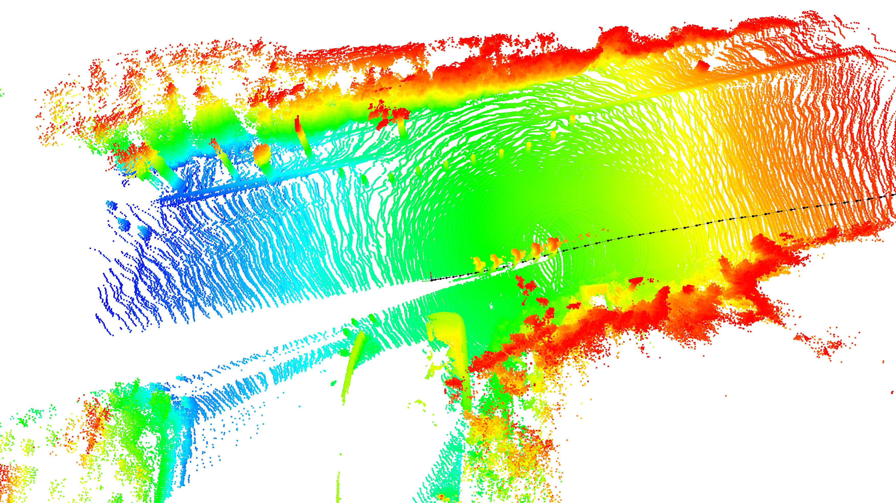

## Trajectory & Point Cloud Visualize Tool


- **GNSS 궤적(trajectory)과 LiDAR 포인트클라우드**를 같은 좌표계로 정렬해 시각화합니다.
- **시간 동기화(time sync)와 외부 파라미터(extrinsics)** 를 적용해 단일 프레임 확인 또는 여러 LiDAR Point Cloud를 병합하여 확인할 수 있습니다.
- GNSS 데이터와 LiDAR 데이터 간의 **time offset을 조정**하여 병합 퀄리티를 확인하고, 적절한 **time sync**를 맞출 수 있습니다.


### 0) 데이터 준비 (Trajectory 시각화 전)
- **8/22 취득 데이터는 자세(pitch) 축이 반대로 기록됨** → 시각화 전에 `tools/flip_pitch_in_odom.py`로 보정 필요
```bash
python tools/flip_pitch_in_odom.py \
  --input /path/to/GPS/Odom_data.csv \ # 변환할 csv 데이터
  --output /path/to/GPS/Odom_data_pitch_flipped.csv # 출력 csv 데이터
```
### 8/22일 이후 취득시 필요없음


- **LiDAR 데이터 전처리**를 통해 lidar_xyzi 형태로 변환하여야 함
### 1) **BEV 궤적/공분산 시각화** — `tools/plot_gps_bev.py`
```bash
# 단일 CSV로 실행
python tools/plot_gps_bev.py \
  --csv /path/to/GPS/Odom_data.csv \
  --out /path/to/GPS/trajectory_var_bev.png # 이미지를 저장하고자할 때 지정


### 2) Point Cloud Merge — `tools/merge_lidar_gnss.py`
- **설명**: LiDAR 스캔들을 GNSS 시간축에 맞춰 **병합**하고, 궤적 마커와 함께 **인터랙티브**하게 시각화
- **입력**: `--gps_csv`, `--lidar_dir`, `--extrinsics_yaml`, `--time_offset`(나노초), 병합 범위 제어(`--start_index`, `--index_interval` 등)
- **키 조작**: ←/→ : 스캔 이동, ,/. : 시간 오프셋 변경

```bash
python tools/merge_lidar_gnss.py \
  --gps_csv data/test0820_23_36/GPS/Odom_data.csv \ 0번에서 만든거 (8월 22일 이후는 그냥 odom data를 입력으로)
  --lidar_dir data/test0820_23_36/lidar_xyzi \ (정제된 lidar -> 승훈이한테 코드 받기)
  --time_offset 0.389 \ (gps와 lidar의 시간 차이, ms)
  --offset_step_ns 0.1 \ (시간 오프셋 간격, ms)
  --extrinsics_yaml extrinsics.yaml \ ((4,4) 행렬, yaml 파일 형식)
  --start_index 10 \ (lidar 시작 index)
  --index_interval 10 \ (merge잘됐는지 보려면 10, annotation 업체에 맡길경우 1)
  --max_frames 10 \ (합칠 프레임 개수, 10개 하면 오래걸림, 5개 정도로 하는걸 추천)
  --x_range 30 --y_range 30 --z_range 2 \ (lidar 시각화용)
  --target_rate 10 \ (10 고정, lidar hz)
  --verbose
```

### 어노테이션 용
라이다 10프레임을 합쳐서 저장하는 코드

### GPS 데이터 수정
GPS 데이터를 lidar의 timestamp에 맞춰 저장하는 코드


- **유용한 옵션**
  - **--start_index / --index_interval**: 병합 시작 인덱스 / 간격(k)
  - **--max_frames N**: 한 번에 병합할 최대 스캔 수
  - **--max_points N**: 병합 포인트 수 상한(초과 시 트림) (굳이 안건드려도 괜찮음)
  - **--marker_stride K**: 궤적 마커/화살표 간격
  - **--offset_step_ns**: ,/. 키당 시간 오프셋 스텝(ns)
